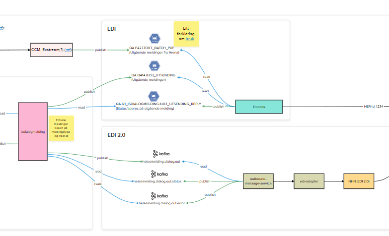
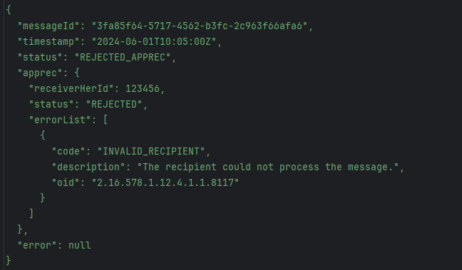
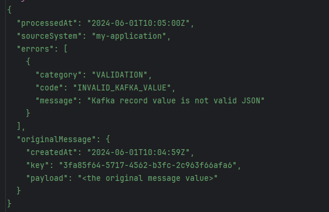
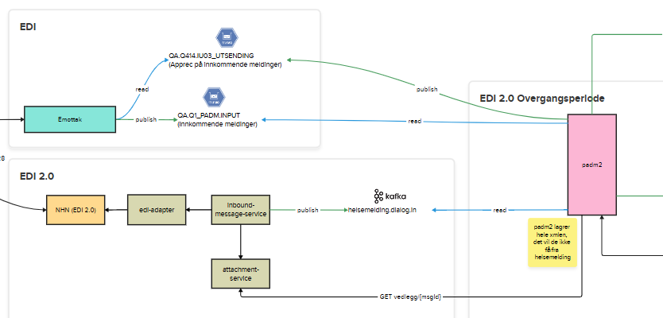

**Endringer i iSYFO sine tjenester i forbindelse med migrering til\
EDI 2.0.**

**Forutsetninger:**

1.  Så at iSYFO sitt fragsystem kan sende og ta imot dialogmeldinger via
    Helsemeldings plattform, skal fragsystemet støtte det grensesnittet
    som plattformen tilbyr.

2.  Det blir en overgangsperiode da iSYFO sitt fragsystem skal sende og
    ta imot dialogmeldinger både via Helsemeldings plattform og via
    eMottak. Siden de to kanalene har forskjellige grensesnitt skal
    fragsystemet ha ekstra forretningslogikk som knytter sammen to
    meldingsflytene.

**Endinger:**

Med utgangspunkt i disse forutsetningene og den planlagte arkitekturen
til Helsemeldings plattform, følger her en liste over endringer som må
gjøres i iSYFO sine tjenester:

1.  **Ny DialogmeldingToBehandlerBestillingDTO.**

[Dette](https://helsemelding-json-schema.intern.dev.nav.no/api/v1/schemas/outgoing-dialog-message/latest)
er en dialogmelding bestilling som iSYFO sitt fragsystem skal sende til
Helsemeldings plattform.

Den er forskjellig fra dagens **DialogmeldingToBehandlerBestillingDTO**
ved at:

- **dialogmeldingType**, **dialogmeldingKodeverk**, **dialogmeldingKode** forenkles
  til **DialogmeldingType** ettersom dette vil redusere muligheten for å
  lage kombinasjoner som er feil.

- **kilde** fjernes til fordel for **sourceSystem** som er implementert
  som Kafka header.

- **dialogmeldingRefParent** og **dialogmeldingRefConversation** grupperes
  sammen under ny type: **ConversationRef** for bedre organisering

- **behandlerRef** er tiltenkt å dekke både behandler og et
  behandlerkontor. Tanken (håpet) er at konsumenter ikke trenger å vite
  noe mer enn **BehandlerRef** og at vi kan finne ut om dette er en
  behandler eller kontor for deretter å sette riktige data.

I en overgensperiode skal iSYFO sitt fragsystem forholde seg både til
**DialogmeldingToBehandlerBestillingDTO** og **OutgoingDialogMessage**.

2.  **Ny DialogmeldingForKafka (innkommende dialogmelding).**

[Dette](https://helsemelding-json-schema.intern.dev.nav.no/api/v1/schemas/incoming-dialog-message/latest)
er en modell som Helsemeldings plattform skal sende til iSYFO sitt
fagsystem.

Den er forskjellig fra dagens **DialogmeldingForKafka** ved at:

- **navLogId** fjernes ettersom det ser ut til å ha med eMottak å gjøre.

- **behandlerRef** og **legeSignaturRef** grupperes sammen under ny

type **Sender** ettersom begge to er informasjon om avsender.

- **personIdentBehandler** erstattes av **Sender.behandlerRef** ettersom
  det

virker ryddigere å forholde seg til **id** fra Behandlerregisteret.

- **legekontorOrgNr**, **legekontorHerId**, **legekontorReshId**,
  legekontorOrgName, legehpr er tiltenkt å fjernes ettersom den
  informasjon burde kunne hentes fra behandlerregisteret basert på
  **Sender.behandlerRef** (eller **Sender.legeSignaturRef**) (dette skal
  dobbeltsjekkes også).

- **journalpostId** fjernes ettersom Helsemeldings plattform ikke skal
  arkivere noe.

- **fellesformatXML** fjernes ettersom konsumentene skal slippe å
  forholde seg til dette og skal ikke ha behov for informasjon i XML (i
  så fall bør topic utvides)

- **dialogmeldingRefParent** og **dialogmeldingRefConversation**
  grupperes sammen under ny type: **ConversationRef** for bedre
  organisering.

I en overgensperiode skal iSYFO sitt fragsystem forholde seg både til

**IncommingDialogMessage** og **DialogmeldingForKafka**.

3.  **isdialogmelding skal rute utgående meldinger enten til
    Helsemeldings plattform eller til eMottak.**

I en overgangsperiode skal **isdialogmelding** tjenesten bruke data fra
en dialogmelding bestilling og Behandlerregistret for å velge om en
utgående melding skal videresendes til Helsemeldings plattform eller
behandles på en vanlig måte og så videresendes til eMottak.
Forretningslogikken til denne prosessen er foreløpig ikke fastlagt, men
vil mest sannsynlig være basert på **behandlerRef.**

{width="6.3in" height="3.829861111111111in"}

4.  **Et nytt scenario for behandling av innkommende AppRec.**

I dagens løsning sender eMottak innkommende AppRec til
**isdialogmelding** via IBM MQ.

Helsemeldings plattform bruker et annet scenario. Den publiserer
oppdateringer av meldings status i en Kafka topic.
**MessageStatusEvent** kan inneholde en AppRec eller en feil.

{width="6.3in" height="3.6840277777777777in"}

Hvis det skjer en feil ved utsending av en melding i selve Helsemeldings
plattform, blir en **MessageErrorEvent** sendt til en annen Kafka topic.
**MessageErrorEvent** inneholder blant annet selve meldingen som
feilet**.**

{width="5.84456583552056in"
height="3.760941601049869in"}

I overgangsperiode skal **isdialogmelding** forholde seg både til XML
AppRec-er fra eMottak og hendelsesstrøm fra Helsemeldings plattform.

5.  **padm2 skal fortsatt sende dialogmeldinger til Arena.**

Siden Arena relatert funksjonalitet vil før eller senere utfases, skal
ikke Helsemeldings plattform sende innkommende meldinger til Arena. I
steder skal **padm2**:

- Hente **InncommingDialogMessage** fra Kafka.

- Hente meldingens vedlegg fra **attachment-service** tjeneste, hvis det
  finnes.

- Journalføre meldingen.

- Generere **ArenaDialogNotat** og sende den til Arena på en vanlig
  måte.

I overgensperiode skal også **padm2** prosessere dialogmeldinger som
kommer fra eMottak på vanlig måte**.**

{width="6.3in" height="3.0215277777777776in"}
